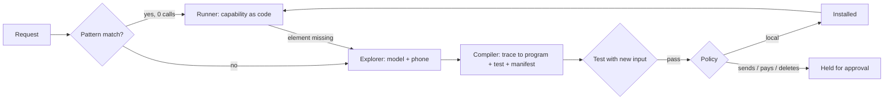

# Stitch

**The phone agent that grows new limbs, not new privileges.**

Built from scratch on the night of October 8 to 9, 2026, for the Frankenstein track of the Agents 0.0.7 hackathon (Etnetera Core, Prague). The commit history starts at 20:44 that evening.

Stitch drives a real Android phone. When you ask for something it cannot do yet, it notices the gap, explores the app with a model, writes the missing capability as code, tests it with a different input, installs it, and from then on runs it **as plain code with zero model calls**. When an app update breaks a capability, it repairs it and installs the next version. Anything that sends, posts, pays or deletes is held until a person approves it.

## The Frankenstein loop

| Brief | What Stitch does |
|---|---|
| **Gap found** | The request matches no installed capability, so Stitch says so and starts building. |
| **Built** | The model explores the app screen by screen (accessibility tree, not screenshots). The trace is compiled into a parameterized program: steps with stable selectors, templates like `{{hour\|pad2}}:{{minute}}`, trigger patterns and a success check. |
| **Tested** | The program runs again with a **different input** and must show its result on screen. No passing test, no install. |
| **Installed** | Code, test result and a permission manifest go into `registry/<name>/`, every version kept. |
| **Reused** | A new session starts with empty memory, loads the registry from disk and runs the capability as code. |
| **Evolved** | When a step no longer finds its element, Stitch explores again from the same app, recompiles, retests and installs v2. |
| **Authority does not grow** | The agent starts with `read_screen, tap, type` and effect `local`. A capability whose step sends, posts, pays or deletes is saved as **held**; it runs only after a person approves it. After an irreversible step, Stitch never retries or re-explores on its own. |

## Measured on a real phone (Samsung Galaxy, Android 16)

| Capability | Learning (first run) | Reuse as code |
|---|---|---|
| `clock.set_alarm(hour, minute)` | 25.3 s, 11 model calls, $0.0054 | 3.7 s average over 3 runs, **0 calls, $0** |
| `maps.search_place(query)` | 19.9 s, 9 calls, $0.0041 | 1.8 s average over 3 runs, **0 calls, $0** |
| `maps.search_place` v2 (repair after a simulated app update) | 19.4 s, 6 calls, $0.0025 | 1.8 s, **0 calls** |
| `clock.delete_alarm(time)` | learned up to the Delete tap, then **held** | after Approve: 6.4 s, **0 calls**, verified the alarm is gone |

Model: Claude Haiku 5.5 (costs at API list price, $0.10 / $0.50 per million tokens). Data extraction: 15 places from a lazy-loading Google Maps list in 5 s; the model writes the field rules once (1 call), collection and scrolling are code.

**Honest numbers.** 27 tasks ran on the phone tonight: 10 succeeded, 16 failed, 1 was held. Almost all failures happened while the loop was being built (a small model drifting from the JSON format, regex dialects, missing zero padding, a long list it could not search). Each failure led to a fix that is in the history: forced tool calls, a `find` action, pattern normalization, automatic padding repair. The offline tests (`npm test`, 11 tests) cover the compiler, pattern dialects, extraction rules and the authority policy using data recorded from the phone.

## How it works



- **Hands** (`hands/`, Kotlin): an accessibility service plus its own keyboard (IME) on the phone, reached over `adb forward`. It reads the screen in about 20 ms (a `uiautomator` dump takes about 2.5 s), taps and long-presses through accessibility actions, types like a keyboard and submits with the field's own action. It also lists installed apps by the names people see.
- **Engine** (`src/`, Node): explorer, compiler, runner, registry, policy, extraction, live MJPEG video of the phone (scrcpy server to ffmpeg) and a JSON + server-sent-events API.
- **Studio** (`studio/`, Next.js 16 + Tailwind 4): chat with the agent, live phone you can tap and swipe with the mouse, a filmstrip of what the phone showed at each step, learning vs reuse costs, the capability registry with Approve and Simulate app update, and data tables with CSV download.

The model never sees screenshots. It gets the accessibility tree as short lines such as `46 button "Add alarm" #menu_alarm_add` and answers through a forced function call, so its output always has the expected shape.

## Run it

```bash
# phone connected over USB with USB debugging on
ADB=/path/to/adb hands/install.sh          # build, install and enable Hands and its keyboard
cp .env.example .env                       # model endpoint and key, ADB path, serial
node --env-file-if-exists=.env src/server.mjs
cd studio && npm install && npm run dev     # http://localhost:3400
npm test                                    # offline tests
```

`hands/restore-keyboard.sh` switches the phone back to the keyboard it had before.

## Limits

- One phone, one task at a time. Samsung apps were the main test bed.
- Elements are found by resource id and stable label text. Apps that draw everything in one view (games, some web views) are out of reach.
- Data extraction expects a list of rows with readable text; images are ignored.

Built with Claude Code by Petr Kynčl (MationX).
